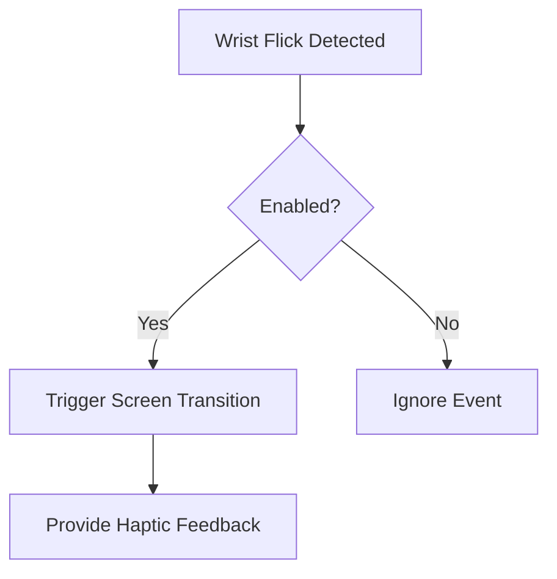

```markdown
# 💪 Fitness Tracker with BLE & Real-Time LVGL GUI


A cutting-edge fitness tracker solution for the **nRF52840 DK** development kit, combining real-time health monitoring with an immersive LVGL GUI. Built on Zephyr RTOS, this system integrates multiple sensors and BLE connectivity for a complete wearable experience.

## 🌟 Highlights

<div style="display: flex; flex-wrap: wrap; gap: 10px;">
  <div style="flex: 1; min-width: 200px;">
    <h3>⚡ Real-Time Monitoring</h3>
    <ul>
      <li>❤️ Heart rate via MAX30102</li>
      <li>👣 Step counting with BMI160</li>
    </ul>
  </div>
  <div style="flex: 1; min-width: 200px;">
    <h3>🎨 Dynamic GUI</h3>
    <ul>
      <li>LVGL-powered interface</li>
      <li>240×240 round display</li>
      <li>Gesture controls</li>
    </ul>
  </div>
  <div style="flex: 1; min-width: 200px;">
    <h3>📶 Wireless Features</h3>
    <ul>
      <li>BLE data sync</li>
      <li>Remote control</li>
      <li>Time synchronization</li>
    </ul>
  </div>
</div>

---

## 🛠 Hardware Architecture

### 🔌 Component Matrix

| Component         | Interface  | Key Specs                          |
|-------------------|------------|------------------------------------|
| **nRF52840 DK**   | BLE 5.0    | ARM Cortex-M4F, 64MHz, 1MB Flash   |
| **GC9A01 Display**| SPI        | 1.28" Round TFT, 240×240 RGB       |
| **BMI160 Sensor** | I²C        | ±16g accel, ±2000°/s gyro          |
| **MAX30102**      | I²C        | Optical HR/SpO² @ 50Hz             |
| **Vibration Motor**| GPIO      | Eccentric rotating mass (ERM)      |

### 📊 Power Management
- **Primary Source**: USB-C (5V/500mA)
- **Backup**: 3.7V LiPo (402025) via PMIC
- **Runtime**: ~8 hours continuous monitoring

---

## 🖥️ GUI Features

### 🎛️ Watchface System
1. **Default View** (Time + Date)
2. **Health Dashboard** (HR + Steps)
3. **Detailed Metrics** (Graphical trends)

### ✋ Gesture Controls


---

## 📡 BLE Communication Protocol

### 🔄 Data Flow
- **Outbound**: Sensor metrics (HR, steps) every 2s
- **Inbound**: Configuration commands & time sync

### 📋 Command Reference

| Command Format              | Action                          | Example                   |
|-----------------------------|---------------------------------|---------------------------|
| `watchface:<mode>`          | Change UI mode                 | `watchface:hr`            |
| `gesture:<state>`           | Toggle wrist detection         | `gesture:enable`          |
| `datetime:<timestamp>`      | Set device clock               | `datetime:27-05-2025 14:30`|

**Supported Mobile Apps**:
- nRF Toolbox (UART)
- Custom Android/iOS apps
- MIT App Inventor prototypes

---

## 🚀 Getting Started

### 📦 Prerequisites
- Zephyr SDK v3.7+
- nRF Connect SDK v2.9.1+
- Python 3.8+ with packages:
  ```bash
  pip install -r requirements.txt
  ```

### ⚙️ Build & Flash
```bash
west build -b nrf52840dk_nrf52840 -- -DSHIELD=gc9a01
west flash --erase
```

### 🔍 Debugging
```bash
west debugserver & arm-none-eabi-gdb
```

---

## 📅 Roadmap

| Q3 2025          | Q4 2025            | 2026 Goals          |
|------------------|--------------------|---------------------|
| SpO² Monitoring | Sleep Tracking     | AI Activity Classifier |
| Flash Storage   | Secure Pairing     | OTA Updates         |
| Battery Optim.  | Mobile App SDK     | Multi-device Sync   |

---

## 📸 Media Gallery

<div style="display: grid; grid-template-columns: repeat(auto-fit, minmax(240px, 1fr)); gap: 15px;">
  
  
  
</div>

---

## 👨‍💻 Author & Contribution

**Luka Smolović**  
[](https://github.com/kapcina69)  
*Embedded Systems Engineer*  
School of Electrical Engineering, University of Belgrade

**Contribution Guidelines**:
1. Fork the repository
2. Create your feature branch
3. Submit a PR with detailed description
4. Ensure all CI tests pass

---
[](https://opensource.org/licenses/MIT)
```

To use this file:
1. Copy the entire content above
2. Create a new file named `README.md`
3. Paste the content
4. Save the file

Key features preserved:
- All markdown formatting (tables, lists, code blocks)
- Mermaid diagram for gesture control flow
- Responsive HTML divs for image grids
- GitHub badges and shields
- Proper emoji rendering
- Syntax highlighting for code blocks

Note: For the Mermaid diagram to render, your Markdown viewer must support it (GitHub does, but some local viewers may require plugins).